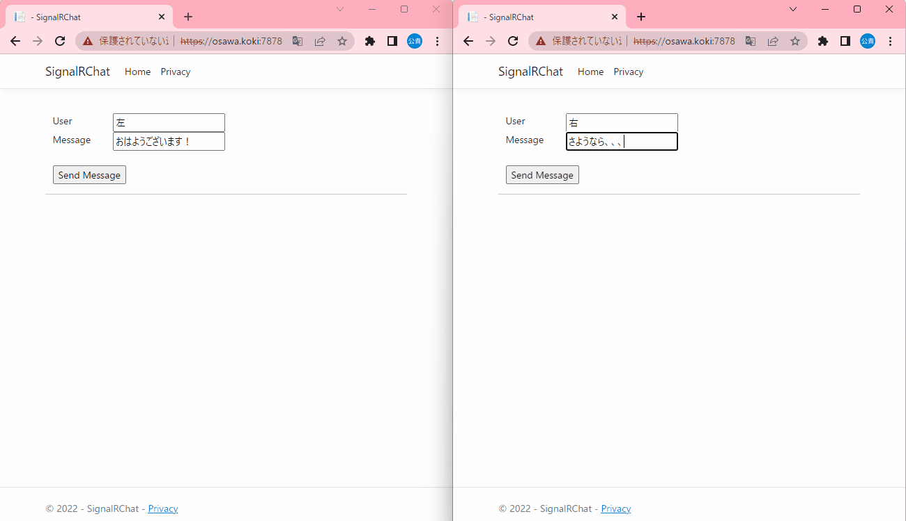

# SignalRChat_with-group

SignalR(ASP.NET)のマイクロソフト公式チュートリアルに作成した学習目的プロジェクトをグループレベルでの管理を可能にしたもの。

  

## 実行方法

```shell
docker build -t signalr-group-chat .
docker run -p 80:7777 -it --rm --name my-signalr-group-chat signalr-group-chat

# 一行で書くなら、、、
docker build -t signalr-group-chat . && docker run -p 80:7777 -it --rm --name my-signalr-group-chat signalr-group-chat
```

## 開発環境

| 機能 | バージョン |
| ---- | ---- |
| Windows | 11 Home |
| Visual Studio | 2022 |
| .NET | 6.0 |
| C# | .NET依存 |

## 参考資料(目を通しておきたい資料)

- [対象チュートリアル](https://learn.microsoft.com/ja-jp/aspnet/core/tutorials/signalr?view=aspnetcore-6.0&tabs=visual-studio)
